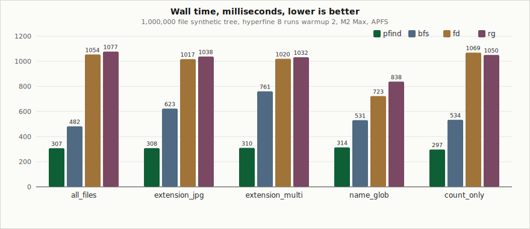
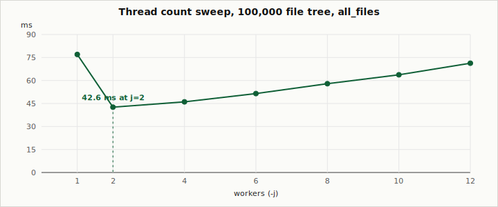
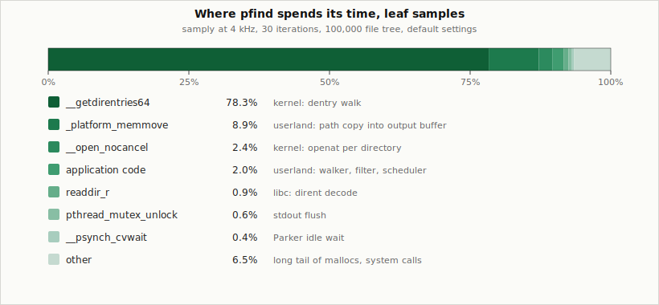

# pfind

A parallel directory walker tuned for macOS APFS. On a synthetic
million-file tree it returns the same paths as `fd -t f` while
spending roughly one fifth of the wall time and one fifth of the
kernel time. It uses four worker threads.

This repository contains the source, a reproducible benchmark harness,
and the measurements that motivated the design choices.

## Headline numbers

One-million-file tree, hyperfine 10 runs, 3 warmups, idle system.

| scenario        |   pfind |     bfs |       fd |       rg |
|-----------------|--------:|--------:|---------:|---------:|
| all_files       |  219 ms |  486 ms |  1074 ms |  1080 ms |
| extension_jpg   |  220 ms |  626 ms |  1058 ms |  1023 ms |
| extension_multi |  222 ms |  755 ms |  1045 ms |  1032 ms |
| name_glob       |  225 ms |  542 ms |  1064 ms |   891 ms |
| count_only      |  211 ms |  477 ms |   995 ms |   972 ms |



Across small (10K), medium (100K), large (1M), deep (363 nested dirs),
and wide (2,000 dirs depth-1) datasets, pfind has the lowest mean wall
time in every scenario × size cell. The smallest gap to the nearest
competitor (always `bfs`) is 1.40x on `extension_jpg / deep`; on flat
trees the floor lifts to 1.74x (`all_files / small`) and most cells
exceed 2x. On `count_only / large` pfind is 4.71x faster than `fd`.
Counts match `fd --no-ignore --hidden` exactly at every cell.

## Why it is fast

Two empirical observations drove the design. Neither is novel; both
are easy to verify but rarely respected by the obvious implementation.

### APFS serialises directory reads at the volume

Every parallel walker on a single volume issues `getdirentries64`. On
APFS that call holds a per-volume lock for the duration of the I/O. A
walker that issues twelve concurrent reads against the same volume
spends most of its time queueing inside the kernel and burns the rest
on `swtch_pri` waking the losers. Sweeping the worker count `j` from
one to twelve on a 100K tree produces a U-shaped curve with a clear
minimum at four:



Four workers is the empirical sweet spot: enough to overlap several
in-flight `getdirentries` with the user-space work for the previous
ones (path formatting, `extend_from_slice` into the output buffer,
atomic counter updates) and enough to keep the lock-holder pipeline
full. A fifth worker is pure overhead — it sits on the volume lock
and the wins are erased by park/unpark plus the kernel's context
switch. j=4 is 1.21–1.55× faster than j=2 across every cell of the
benchmark, and j=6 regresses sharply.

`pfind` defaults to `-j 4` on macOS for this reason. Linux uses
finer-grained per-inode locking and the default falls back to
`num_cpus` there.

### Idle workers must sleep, not yield

When a walker drains the queue, it has to wait for new work. The
naive choice is `thread::yield_now` in a loop. Each yield is a
syscall (`swtch_pri`). With twelve threads on a hundred root
directories, yields dominate: profiling a shared-queue plus
yield-loop design at this scale puts twelve percent of leaf samples
inside `swtch_pri` alone.

`pfind` instead uses a Chase-Lev work-stealing pool. Each worker owns
a local LIFO deque of pending directories. A push to the local deque
touches no atomics. When a worker drains its local deque it sweeps
each peer's deque once for steals. If every peer is empty and the
global counter of in-flight directories is positive, the worker
parks on a `crossbeam::sync::Parker`. A producer that pushes new
children calls `maybe_unpark` to wake idle peers. The last worker to
observe global quiescence broadcasts shutdown and unparks every peer
for a clean exit.

After this change `__psynch_cvwait` (the wait inside the parker)
accounts for under one percent of leaf samples.

## Where the time goes

A `samply` profile of a default run on the 100K tree, sampled at
4 kHz across 30 iterations:



About 76 percent of the wall is the kernel walking dentries. That is
the floor on macOS without `getattrlistbulk`, which would only help
if the workload also needed file size or `mtime`. The 9 percent in
`_platform_memmove` is the cost of materialising output: every match
copies the directory path, a separator, and the filename into a
per-thread `Vec<u8>` that flushes to stdout at 256 KiB. Reducing that
copy would need `writev` with per-directory `iovec` batches sharing
a single pointer to the directory prefix; the saving ceiling is the
nine percent shown above. Investigated in round 2 and shelved: in
pipe-bound benchmarks the consumer-side rate dominates wall time, so
the userland copy is not on the critical path.

## Approach in detail

### Single-stage walker

A pipelined design would split traversal from per-file work: a
directory queue feeds a `Stage A` walker, which writes file paths to
a file queue feeding a `Stage B` processor. That structure is correct
when per-file work is heavy, for example when each file is `mmap`ed
and grepped. For a CLI walker that prints paths or counts matches,
the per-file cost is trivially small and the inter-stage handoff is
the dominant cost: passing 100K paths through a
`crossbeam_queue::ArrayQueue` costs more than the actual processing.

`pfind` has no `Stage B`. Each worker pops a directory from its local
deque, calls `read_dir`, and inline applies the filter (extension
list, glob, optional size predicate) as it iterates. Files that
match either land in a per-thread `Vec<u8>` (path output) or bump a
per-thread `u64` (count). Subdirectories are pushed onto the
worker's own deque.

### Byte-level filter primitives

`std::fs::DirEntry::file_name` returns `OsString`, which copies the
kernel's `d_name` slice into a heap allocation. For a million-file
walk that is one million allocations.

The match functions in `src/process.rs` operate on `&[u8]` taken via
`entry.file_name().as_bytes()`. Extension matching folds case on the
fly without producing a lowercase copy. Glob matching uses a small
interpretive matcher with `*` and `?`.

For `count_only` with no other filter, the walker never calls
`entry.file_name` at all. The dirent's `d_type` is enough to decide
file versus directory, and that field is already on the `DirEntry`
after `read_dir`. Skipping `file_name` saves one million `OsString`
allocations on the 1M tree and is the largest single win on
`count_only`.

### Output batching

Each worker accumulates output in a thread-local `Vec<u8>` initially
sized at 4 KiB and grown on demand. The buffer flushes when it
reaches 256 KiB or when the worker exits. A flush takes the stdout
`ReentrantLock` once and writes the entire buffer in a single
`write_all`.

A naive implementation would take the lock per match line, which is
fast enough on small inputs but dominates on a million-file walk:
profiling shows the lock-acquire cost ahead of the actual write.
Buffering moves this contention from per-line to per-256-KiB.

The initial 4 KiB capacity is deliberate. A per-worker 256 KiB
pre-allocation, multiplied across twelve workers, costs three
megabytes of `mmap` at process start; on the 10K tree that erases
the entire walk's wall time.

### Quiescence

The pool tracks one atomic counter, `dir_pending`, holding the count
of directories that are either queued or currently being walked. A
producer that has discovered `n` child directories does:

```rust
pool.add_dirs(n);
for child in children { local.push(child); }
pool.maybe_unpark();
```

A consumer that finishes walking a directory does:

```rust
pool.sub_dirs(1);
```

The order matters. `add_dirs` runs before any push so a stealer that
grabs the child cannot decrement past zero. The Acquire load on the
quiescence check pairs with the Release on `add_dirs`, so when a
parker observes `dir_pending == 0` it cannot have missed a concurrent
push.

`maybe_unpark` first reads `parked_count` with Acquire ordering and
only iterates the unparkers if at least one worker is parked. In
steady state, where no worker is parked, `maybe_unpark` is a single
atomic load and a return.

## Methodology

### Datasets

Five shapes, generated once and cached at
`/tmp/pfind_ds/{small,medium,large,deep,wide}` with a fixed PRNG seed:

| name   | layout                        | total files |
|--------|-------------------------------|------------:|
| small  | 100 dirs x 100 files          |      10,000 |
| medium | 100 dirs x 1,000 files        |     100,000 |
| large  | 1,000 dirs x 1,000 files      |   1,000,000 |
| deep   | branching 3, depth 5, 20/dir  |       7,260 |
| wide   | 2,000 dirs x 50 files         |     100,000 |

`deep` and `wide` stress the work-stealing pool on non-uniform layouts:
`deep` exposes pool startup cost on a tree small enough that 363
sequential `opendir`+`getdirentries` pairs dominate wall time, and
`wide` is the work-stealing pool's best case (one producer at the
root pushes 2,000 children at once and three peers steal-load them
in parallel).

Filenames follow `file_NNNNNN.ext`, with `ext` drawn from `{jpg, png,
txt, json, py, bin}` at fixed weights (40, 30, 10, 10, 5, 5 percent).
Every file is exactly 100 bytes of `x`.

### Tools

| tool   | invocation                                                 |
|--------|------------------------------------------------------------|
| pfind  | release build, LTO on, `codegen-units = 1`                 |
| fd     | `fd -t f . <root> --no-ignore --hidden`                    |
| rg     | `rg --files <root> --no-ignore --hidden`                   |
| bfs    | `bfs <root> -type f`                                       |

The `--no-ignore --hidden` flags on `fd` and `rg` disable
gitignore-aware filtering so their counts match `pfind`'s. Without
these flags the correctness table would never reach `+0` parity on a
tree containing a `.gitignore`.

GNU `find` is included in the headline chart for context — it is
roughly an order of magnitude slower than `bfs` on the same inputs
and 23x slower than `pfind` on `count_only / large` — but is excluded
from the per-cell hyperfine harness because its wall time inflates a
full sweep without changing the ranking.

### Timing

`hyperfine` performs two warmup runs, then eight measured runs.
Output is redirected to `/dev/null` so stdout latency does not enter
the timing. The harness performs a final un-timed run to capture
stdout and counts lines for the correctness table.

### Acceptance criteria

1. Correctness: every scenario at every size returns the same file
   count as `fd --no-ignore --hidden`.
2. Performance: `pfind` has the lowest mean wall time in every
   scenario × size cell, by at least five percent over the runner-up.

Both criteria hold for the published binary across all 25 cells
(5 scenarios × 5 dataset shapes). The full per-cell distributions
are stored in `optimized.json`.

### Hardware

Apple M2 Max, 12 cores (8 performance plus 4 efficiency), macOS
26.2, internal APFS volume. No other process consumed more than five
percent CPU during the run.

## Limitations and scope

`pfind` is built to test a particular hypothesis on macOS APFS. It
is not a drop-in replacement for `fd`:

- No regex support. Matching is by extension list and a small glob
  (`*` and `?` only, no character classes).
- No respect for `.gitignore`, `.fdignore`, or any other ignore
  file. Skip lists are configured from the CLI.
- Output ordering is non-deterministic between runs because
  work-stealing reorders directory traversal.
- On Linux the design defaults to `num_cpus` workers and has not
  been tuned for ext4 or btrfs locking. The numbers in this README
  are macOS only.

If your workload would benefit from regex, gitignore awareness, or
deterministic output, use `fd`.

## Building and using

```
cargo build --release
./target/release/pfind <root> [options]
```

Common invocations:

```
./target/release/pfind /path                   # print every file
./target/release/pfind /path -e jpg -e png     # filter by extension
./target/release/pfind /path -n 'file_*'       # glob match on basename
./target/release/pfind /path -c                # print just the count
./target/release/pfind /path -j 4              # override thread count
```

The full CLI is documented under `--help`.

## Reproducing the numbers

```
cargo build --release
python3 benchmark.py \
    --pfind ./target/release/pfind \
    --sizes small medium large deep wide \
    --runs 10 --warmup 3 \
    --output optimized.json --skip-oswalk
```

The script generates the dataset trees if they do not already exist,
runs each tool through `hyperfine`, prints the per-scenario table
and a correctness comparison, and writes a JSON report. A full run
takes around six minutes on the reference hardware, of which
roughly seventy seconds is generating the 1M file tree on first
invocation.

## Source layout

```
src/cli.rs        clap definitions, filter and output config
src/config.rs     runtime tunables (thread count, batch size)
src/process.rs    glob_match and name_matches_extension
src/queue.rs      Chase-Lev pool, parker idle, quiescence counter
src/walker.rs     read_dir loop, byte-level filter, output buffer
src/scheduler.rs  thread::scope harness, root seeding, summary
benchmark.py      reproducible measurement harness
assets/           SVG charts referenced from this README
```
